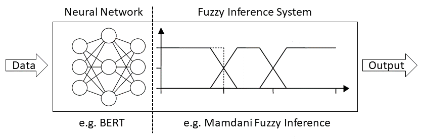

# Neurofuzzy Semantic Similarity Measurement
Code of the paper *Martinez-Gil, J., Mokadem, R., Küng, J., & Hameurlain, A. (2023). Neurofuzzy semantic similarity measurement. Data & Knowledge Engineering, 145, 102155.*

[](https://github.com/jorge-martinez-gil/dke2023/first.png "Image")

# Synopsis
This paper presents a novel approach for computing semantic similarity between words using a combination of neural networks and fuzzy logic, called neurofuzzy semantic similarity measurement. Semantic similarity is a measure of how closely related two words are in meaning, and is an important task in natural language processing, information retrieval, and other related fields.

# Methodology
The neurofuzzy semantic similarity method consists of two main components: a neural network and a fuzzy logic system. The neural network is trained on a large corpus of text to learn the representations of words. The fuzzy logic system, on the other hand, uses expert knowledge in the form of fuzzy rules to compute semantic similarity between the representantion of the words.

# Dependencies
```java
import org.moeaframework.Executor;
import org.moeaframework.core.NondominatedPopulation;
import org.moeaframework.core.Solution;
import org.moeaframework.core.variable.EncodingUtils;
import org.moeaframework.core.variable.RealVariable;
import org.moeaframework.problem.AbstractProblem;

import com.github.chen0040.data.utils.TupleTwo;
import com.github.chen0040.gp.commons.BasicObservation;
import com.github.chen0040.gp.commons.Observation;

import jmetal.core.Variable;
import net.sourceforge.jFuzzyLogic.FIS;
```
# Usage
The present prototype does not implement the neural part. In fact, the software https://github.com/Huffon/sentence-similarity has been used to generate the features that serve as input to the neural component. 

Therefore, the present software takes as input the features files. As explained in the article, the features are obtained after running the neural model with different parameters and language models. For more information see the **datasets** folder.

The fuzzy component has to have a training phase where we learn a complete fuzzy controller able to map the features of neural nature to a real number in the interval [0, 1]. We use the **jmetal** library that allows a wide range of evolutionary strategies to support the evolutionary learning process of the fuzzy component.

Finally, the test data set must be tested to obtain the result. It is recommended to run the prototype several times in order to calculate mean and/or median values.

# Citation
If you use this work, please cite:

```
@article{martinez2023neurofuzzy,
  title={Neurofuzzy semantic similarity measurement},
  author={Martinez-Gil, Jorge and Mokadem, Riad and K{\"u}ng, Josef and Hameurlain, Abdelkader},
  journal={Data \& Knowledge Engineering},
  volume={145},
  pages={102155},
  year={2023},
  publisher={Elsevier}
}
```

# License
This code is released under the MIT License. See the LICENSE file for more information.