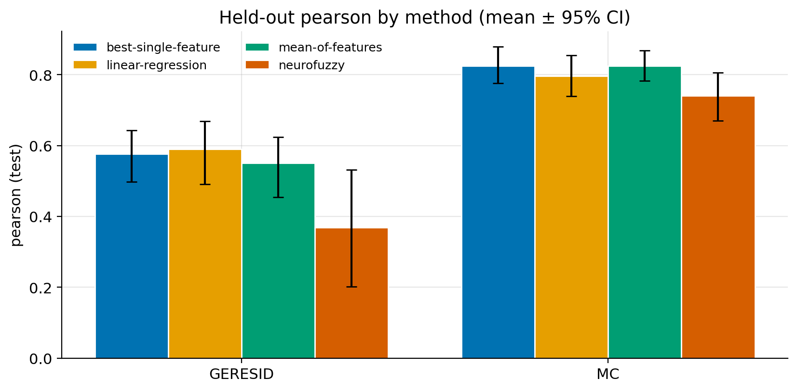
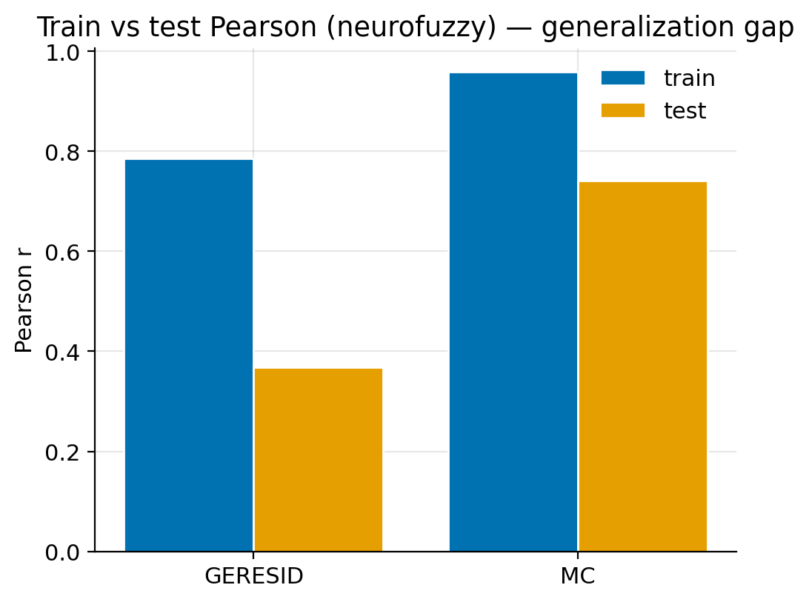

# Neurofuzzy Semantic Similarity Measurement

> **Reproducible fuzzy-inference for semantic similarity** — a clean Python
> package, a one-command benchmark harness with baselines and statistical tests,
> and publication-quality figures. Companion code for the *Data & Knowledge
> Engineering* (2023) article by Martinez-Gil et al.

[](https://github.com/jorge-martinez-gil/dke2023/actions/workflows/ci.yml)
[](https://www.python.org/)
[](LICENSE)
[](https://doi.org/10.1016/j.datak.2023.102155)
[](https://doi.org/10.1016/j.datak.2023.102155)
[](CITATION.cff)

## What problem does this solve?

Measuring **semantic similarity** between words or short texts is a core task in
natural language processing, information retrieval, and knowledge engineering.
Many neural and lexical measures each capture a different facet of similarity.
This project learns a small, interpretable **Mamdani fuzzy inference system**
that aggregates several such neural similarity features into a single robust
score in `[0, 1]`, with the fuzzy parameters optimized by **Differential
Evolution**.

## Why is it useful?

- **A reusable benchmark.** Even if you do not use the fuzzy method, you get a
  standardized train/test protocol, reference baselines, repeated-seed
  evaluation, bootstrap confidence intervals, and paired significance tests — run
  with a single command.
- **Trustworthy and reproducible.** Every reported number is regenerated from
  data with a recorded manifest (versions, git commit, configuration). Nothing
  is hard-coded.
- **Fast and dependency-light.** The fuzzy controller is pure NumPy and fully
  vectorized (~50× faster batch prediction than the original loop implementation,
  with results verified identical to the per-sample path across randomized tests).
- **Teachable.** Worked examples, a getting-started notebook, and clear module
  boundaries make it suitable for courses in data/knowledge engineering, NLP, and
  soft computing.

## Which paper does it support?

> Martinez-Gil, J., Mokadem, R., Küng, J., & Hameurlain, A. (2023).
> **Neurofuzzy semantic similarity measurement.** *Data & Knowledge Engineering*,
> 145, 102155. https://doi.org/10.1016/j.datak.2023.102155

The legacy Java/jFuzzyLogic prototype that accompanied the article is preserved
under `src/` and `fcl/` for historical reference. The maintained implementation
is the Python `neurofuzzy` package.

## Architecture

```text
Word/Text pairs
      │
      ▼
[ Neural similarity features ]      (4 precomputed signals per pair)
      │
      ▼
[ Mamdani Fuzzy Controller ]  ◀── Differential Evolution optimizer
      │                            (40 bounded parameters, fixed seed)
      ▼
 Similarity score ∈ [0, 1]
```

## Installation

```bash
git clone https://github.com/jorge-martinez-gil/dke2023.git
cd dke2023
pip install -e .            # runtime only
pip install -e ".[dev]"     # + tests, linting, type-checking, figures
```

Or with conda:

```bash
conda env create -f environment.yml
conda activate neurofuzzy
```

## Minimal example

```python
from neurofuzzy import NeurofuzzyModel
from neurofuzzy.data_loader import load_dataset

X, y = load_dataset("datasets/mc.txt")          # (n_samples, 4), (n_samples,)
model = NeurofuzzyModel(maxiter=40, popsize=8, random_state=0, verbose=False)
model.fit(X, y)
print(model.predict(X[:5]))                       # similarity scores in [0, 1]
print(model.evaluate(X, y))                       # pearson, spearman, MAE, RMSE, ...
```

A runnable version lives in [`examples/minimal_example.py`](examples/minimal_example.py).

## Reproduce the results

Everything below is regenerated from data — no cached numbers.

```bash
# Run the full benchmark (neurofuzzy + baselines, 10 seeds) and aggregate:
python -m neurofuzzy.benchmark --all --seeds 10 --out benchmarks/results

# Generate all figures:
python -m neurofuzzy.visualize --results benchmarks/results --out benchmarks/figures
```

Or simply:

```bash
make repro     # install dev deps, run the benchmark, build figures
```

The runner is **resumable**: if interrupted, re-run the same command and it
continues where it left off. Use `--time-budget <seconds>` to fit work into a
fixed window. Each run also writes `benchmarks/results/manifest.json` recording
package versions, the git commit, and the exact configuration.

## Results

Reproducible results on the two bundled benchmarks (mean over 10 seeds on the
held-out **test** split; optimizer `maxiter=40, popsize=8`, 60/40 split). Full
tables with 95% confidence intervals and significance tests are in
[`benchmarks/results/report.md`](benchmarks/results/report.md), and a LaTeX
table in [`benchmarks/results/results_table.tex`](benchmarks/results/results_table.tex).

| Dataset | Method | Test Pearson r | Test Spearman ρ |
|---|---|---:|---:|
| MC | best-single-feature | 0.826 | 0.750 |
| MC | mean-of-features | 0.825 | 0.756 |
| MC | linear-regression | 0.797 | 0.700 |
| MC | **neurofuzzy** | 0.741 | 0.679 |
| Geresid | linear-regression | 0.590 | 0.440 |
| Geresid | best-single-feature | 0.576 | 0.532 |
| Geresid | mean-of-features | 0.551 | 0.518 |
| Geresid | **neurofuzzy** | 0.368 | 0.375 |



### Honest interpretation

On these **small** benchmarks (MC: 30 pairs, Geresid: 50 pairs) and under the
above configuration, the fuzzy controller fits the training split very well
(train Pearson ≈ 0.96 on MC, 0.79 on Geresid) but **overfits**: its held-out
performance does not exceed the simple baselines, and the gap is largest on the
smaller dataset.



We report this transparently rather than cherry-picking. It is a useful,
reproducible reminder that highly parameterized aggregators need regularization
or more data to generalize — and it is exactly the kind of failure-case analysis
the benchmark harness is designed to surface. Reducing this gap is an open item
on the [roadmap](ROADMAP.md). All numbers depend on the documented
configuration; report it alongside any value you cite.

## Datasets

| Dataset | File | Pairs | Features | Description |
|---|---|---:|---:|---|
| MC | `datasets/mc.txt` | 30 | 4 | Miller–Charles-style word pairs with neural similarity features |
| Geresid | `datasets/geresid.txt` | 50 | 4 | Benchmark pairs with neural similarity features |

Each line is `ground_truth, feature_1, …` (the loader uses the first four
features after the ground-truth column). See [`docs/datasets.md`](docs/datasets.md).

## How do I add a new dataset?

1. Drop a text file in `datasets/` using the format above.
2. Register it in `neurofuzzy/benchmark.py` (`DATASET_FILES`).
3. Run `python -m neurofuzzy.benchmark --all --datasets your_dataset`.

Worked example: [`examples/custom_dataset.py`](examples/custom_dataset.py).

## How do I add a new method?

Implement `fit(X, y)` / `predict(X)` (the baseline API), register it in
`neurofuzzy/baselines.py`, and it is automatically included in the benchmark and
significance tests. Worked example: [`examples/add_baseline.py`](examples/add_baseline.py)
and [`docs/extending.md`](docs/extending.md).

## Project structure

```text
dke2023/
├── neurofuzzy/            # the package
│   ├── fuzzy_controller.py  # vectorized Mamdani controller
│   ├── optimizer.py         # Differential Evolution training
│   ├── model.py             # high-level NeurofuzzyModel API
│   ├── baselines.py         # reference baselines
│   ├── metrics.py           # Pearson/Spearman/cosine/MAE/RMSE
│   ├── benchmark.py         # resumable benchmark runner + reports
│   └── visualize.py         # publication-quality figures
├── datasets/             # bundled benchmarks
├── experiments/          # thin experiment CLI
├── examples/             # runnable, documented examples
├── notebooks/            # getting-started teaching notebook
├── benchmarks/           # committed, regenerable results + figures
├── docs/                 # documentation site (MkDocs)
├── tests/                # unit tests
├── src/ · fcl/ · bin/    # legacy Java prototype (historical reference)
├── CITATION.cff · CHANGELOG.md · SECURITY.md · CODE_OF_CONDUCT.md · ROADMAP.md
├── Makefile · Dockerfile · pyproject.toml · environment.yml
└── README.md
```

## Documentation

Browse [`docs/`](docs/) or build the site locally:

```bash
pip install mkdocs-material
mkdocs serve
```

## Citing

If you use this software or benchmark, please cite the article. GitHub's
"Cite this repository" button reads [`CITATION.cff`](CITATION.cff).

```bibtex
@article{martinez2023neurofuzzy,
  author  = {Jorge Martinez-Gil and Riad Mokadem and Josef K{\"u}ng and Abdelkader Hameurlain},
  title   = {Neurofuzzy semantic similarity measurement},
  journal = {Data \& Knowledge Engineering},
  volume  = {145},
  pages   = {102155},
  year    = {2023},
  doi     = {10.1016/j.datak.2023.102155},
  url     = {https://doi.org/10.1016/j.datak.2023.102155}
}
```

## Contributing

Contributions are welcome — see [CONTRIBUTING.md](CONTRIBUTING.md), the
[roadmap](ROADMAP.md), and the issue templates. Run `make test lint` before
opening a pull request.

## License

MIT License — see [LICENSE](LICENSE).
